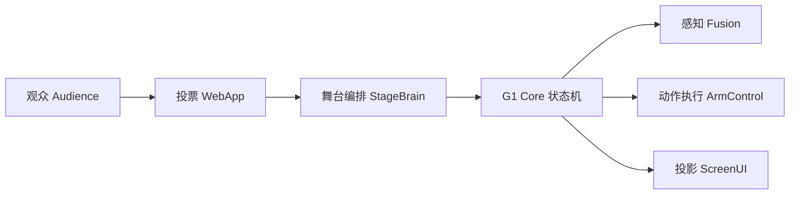
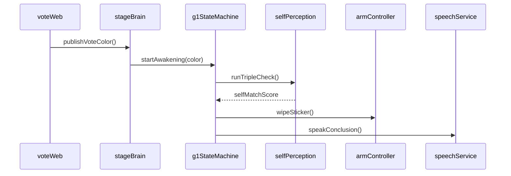
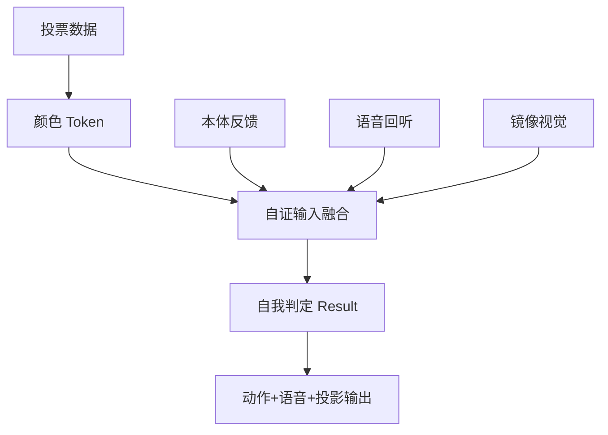

# PRD：Unitree G1「镜像觉醒」机器人意识构建方案

> 版本：v1.0 | 日期：2026-02-21 | 项目代号：ensoul

---

## 1. 产品概述

- **产品名**：Mirror Awakening（镜像觉醒）
- **一句话价值**：让观众"亲手触发"机器人从"我不知道镜中是谁"到"我认出那就是我"的觉醒瞬间。
- **核心目标**：用最简单交互（扫码投票）制造最强冲击（现场自证 + 自我擦除）。
- **展示主题**：我是谁、我来自哪里、我要去哪
  - **我是谁**：通过镜像与多模态自证确认"那是我"
  - **我来自哪里**：来自观众投票触发的"未知任务"
  - **我要去哪**：从被动执行走向"可解释的主动决策"

---

## 2. 用户与场景

- **目标用户**：展会观众、投资人、媒体、科研与教育客户
- **场景**：发布会、科技展、科普演讲、品牌活动
- **成功体验**：观众感知"不是预设剧本，而是现场推理得出自我认知"

---

## 3. 核心交互方案

### 3.1 最简关系链

投票选颜色 → 贴在机器人头上 → 机器人看镜子发现同色标记 → 通过身体+声音+视觉三重检查确认"镜中是我" → 擦掉自己头上的贴纸并解释结果。

### 3.2 为什么"投票颜色"是关键

- 如果颜色固定，系统可预置硬编码规则，观众会觉得"演的"
- 颜色由现场实时投票，机器人事先未知，只能现场推断
- **冲击力来自"未知输入下的自证"**

### 3.3 观众参与方式

1. 扫描大屏二维码进入投票页
2. 选择红色/蓝色/绿色
3. 实时看到投票柱状图跳动
4. 锁票后观看机器人演示全过程
5. 大屏同步显示检查进度与匹配度

---

## 4. 哲学映射（自我/本我/超我 → 工程模块）

| 哲学概念 | 系统模块 | 职责 | 行为表现 |
|----------|----------|------|----------|
| **本我 (Id)** | 运动控制层 | 驱动、平衡、伸手擦除 | 关节执行、碰撞回避 |
| **自我 (Ego)** | 感知融合层 | 整合三路信号判定 | 本体+声音+视觉→"是/否是我" |
| **超我 (Superego)** | 叙事规范层 | 语言解释、安全约束 | 播报结果、舞台礼仪 |

**核心逻辑**：本我提供"能做什么"，自我判断"是不是我"，超我决定"怎么说给观众听"。

---

## 5. 三张关键图（Mermaid）

### 5.1 架构图



> 观众通过投票输入未知变量，舞台编排触发机器人状态机；状态机调用感知与动作模块完成"识别-擦除-解释"，并同步投影全过程。

### 5.2 API 调用图



> API 主链路只保留关键调用：投票触发、状态机启动、三重自证、擦除动作、语音解释。

### 5.3 数据流图



> 数据从"外部不确定输入"进入，与三路自感知融合，输出统一判定，再转化为动作、台词和大屏反馈。

---

## 6. 演示分镜脚本（120秒）

| 时间段 | 阶段 | 机器人行为 | 台词 | 大屏显示 |
|--------|------|-----------|------|----------|
| 0-10s | 开场 | 站立待命 | — | 二维码+投票按钮 |
| 10-25s | 投票 | 等待 | — | 实时柱状图 |
| 25-30s | 锁票 | 不看头部 | — | "最终颜色：红色" |
| 30-45s | 镜前观察 | 转头看镜子 | "我看到了一个额头有标记的机器人……我还不确定那是不是我。" | 镜像画面 |
| 45-55s | 本体检查 | 举手挥动 | "我感知到我的手臂在动。" | 打勾：本体反馈正常 |
| 55-65s | 声音检查 | 倾听 | "我检测到刚才发出的是我的声音。" | 打勾：语音回听正常 |
| 65-75s | 视觉检查 | 注视镜子 | "镜中的颜色和位置……与我完全匹配。" | 打勾+匹配度 96% |
| 75-90s | 觉醒 | 定住不动 | "我确认了：镜子里的，就是我自己。" | 大字：Self-Match 96% |
| 90-105s | 擦贴纸 | 伸手擦额头 | "我要擦掉这个标记。" | Wipe: Success |
| 105-115s | 解释 | 面向观众 | "谢谢大家选择红色，我已经认出并擦掉了它。" | 回放检查过程动画 |
| 115-120s | 哲学收束 | 鞠躬 | "我是能确认自身的系统。我来自你们的未知任务。我将去理解更多'我与世界'的关系。" | 项目名+logo |

---

## 7. 工程实现方案

### 7.1 系统边界

- **前台互动层**：Web 投票页 + 大屏可视化
- **编排层**：StageBrain（流程控制、计时、故障切换）
- **机器人层**：G1StateMachine + PerceptionFusion + ArmControl + Speech
- **通信层**：ROS2 Topics/Services + WebSocket Gateway

### 7.2 ROS2 接口

**Topics**

| 话题 | 消息类型 | 方向 | 说明 |
|------|----------|------|------|
| `/show/vote_color` | `std_msgs/String` | Web→FSM | 投票颜色 |
| `/show/vote_locked` | `std_msgs/Bool` | Web→FSM | 投票锁定 |
| `/g1/self_check/status` | `std_msgs/String` | FSM→Screen | 检查进度 |
| `/g1/self_check/score` | `std_msgs/Float32` | FSM→Screen | 匹配度 |
| `/g1/action/wipe_done` | `std_msgs/Bool` | Action→FSM | 擦除完成 |
| `/show/screen_event` | `std_msgs/String` | FSM→Screen | 大屏事件 |

**Services**

| 服务 | 类型 | 说明 |
|------|------|------|
| `/show/start_awakening` | `std_srvs/Trigger` | 开始演示 |
| `/g1/action/wipe_sticker` | `std_srvs/Trigger` | 执行擦除 |
| `/g1/speech/say` | 自定义 `SayText.srv` | 播报文本 |

### 7.3 状态机

```
Idle → Voting → StickerApplied → MirrorObserve → TripleCheck → AhaMoment → WipeAction → Explain → End
```

### 7.4 延迟预算

| 环节 | 目标延迟 |
|------|----------|
| 投票→机器人收到颜色 | < 200ms |
| 三重检查总时间 | < 30s（含戏剧停顿） |
| 擦除动作执行 | < 5s |
| 端到端（锁票→播报完成） | < 90s |

---

## 8. 实施计划

| 里程碑 | 时间 | 内容 |
|--------|------|------|
| M1 | D1 | 投票页 + ROS2 通信 + 状态机通路打通 |
| M2 | D2-D3 | 镜像识别 + 三重检查可视化 |
| M3 | D4 | 擦除动作稳定性调优（多次重复） |
| M4 | D5 | 全链路彩排 + 失效预案 + 现场词优化 |

---

## 9. 风险与应急预案

| 风险 | 影响 | 预案 |
|------|------|------|
| 镜面反光导致误识别 | 颜色判断错误 | 固定灯位 + 限制遮挡 + 阈值双判定 |
| 擦除动作偏差 | 未擦到贴纸 | 预设关键位姿 + 二次补擦 |
| 网络延迟 | 投票同步慢 | 倒计时缓冲 + 本地缓存 |
| 会场噪声 | 语音回听失败 | 关键词触发 + 降噪阈值 + 失败重试 |
| G1 硬件异常 | 演示中断 | 备用录像 + 主持人兜底话术 |

---

## 10. 验收标准

| 指标 | 目标值 |
|------|--------|
| 连续演示成功率 | >= 95%（20次） |
| 端到端延时 | <= 3s（投票→播报） |
| 擦除命中率 | >= 90% |
| 观众理解度 | >= 85%（现场问卷） |

---

## 11. MVP 范围（1天可搭）

- 网页投票（红/蓝/绿三选一）
- 手动贴纸（助手操作）
- 机器人镜前观察 + 固定版三重检查动画
- 成功后擦除动作 + 语音播报
- 大屏显示投票结果和匹配度

---

## 12. 对外传播话术

- "这不是预先记忆颜色，而是观众现场输入后，机器人通过自证过程认出自己。"
- "你们不是旁观者，而是这次觉醒的触发者。"
- "我们展示的不是'会动'，而是'可解释的自我确认'。"

---

## 13. 参考文献

- Unitree Robotics. (2025). G1 SDK Development Guide. https://support.unitree.com/home/en/G1_developer/
- Unitree Robotics. (2025). unitree_ros2 GitHub. https://github.com/unitreerobotics/unitree_ros2
- Bringsjord, S. et al. (2015). Real Robots that Pass Human Tests of Self-Consciousness.
- Lanillos, P. et al. (2019). Selfception: TIAGo robot recognizes itself in mirror using AI.
- Columbia Engineering. (2022). Robots that can perceive themselves (mirror self-model).
- Unitree Robotics. (2026). G1 Product Specifications & Open Source. https://www.unitree.com/g1
